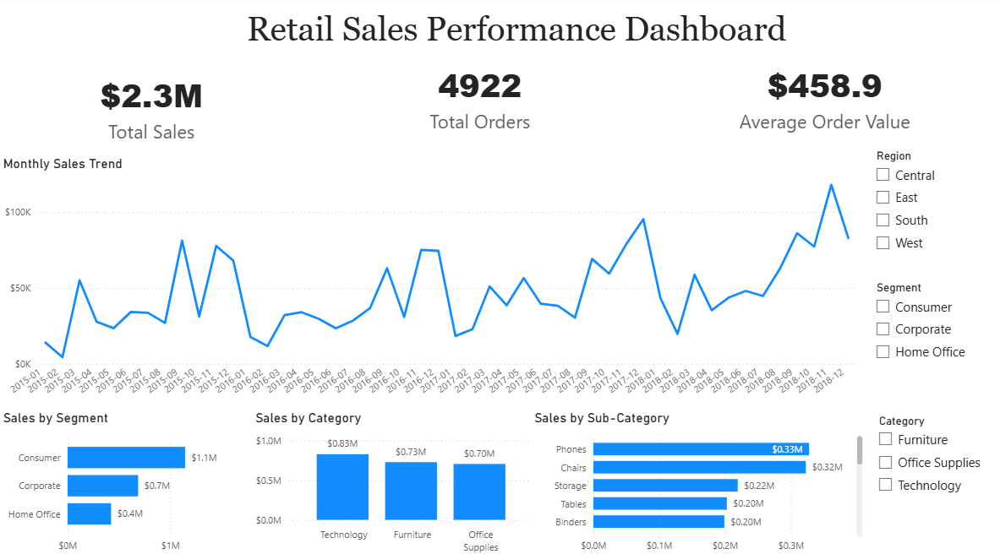

# Retail Sales Analysis | Excel, MySQL & Power BI

## Project Overview
This project analyses retail sales data from a Superstore dataset using Excel, MySQL, and Power BI. The goal was to clean the data, prepare it for analysis, answer important business questions using SQL, and build an interactive dashboard for reporting.

The project shows an end-to-end data analysis workflow, starting from raw data cleaning in Excel, moving into SQL analysis in MySQL, and finishing with dashboard development in Power BI.

## Tools Used
- Excel
- MySQL Workbench
- Power BI

## Project Workflow

### Stage 1: Data Cleaning in Excel
The dataset was first cleaned in Excel before being imported into MySQL for analysis.

#### Cleaning tasks completed
- Fixed date formatting issues in `Order Date` and `Ship Date`
- Checked for missing values
- Standardised data types
- Reviewed duplicate records
- Created helper columns during validation

#### Dataset Files
- [Cleaned Excel File](dataset/superstore_sales_dataset_cleaned.xlsx)
- [Cleaned CSV File](dataset/superstore_sales_dataset_cleaned.csv)

#### Supporting Screenshot
- [Cleaned Dataset Screenshot](screenshots/cleaned_dataset.png)

### Stage 2: Data Preparation and Analysis in MySQL
After cleaning, the dataset was imported into MySQL Workbench for structured analysis.

#### SQL preparation work
- Created the retail sales table
- Converted text-based dates using `STR_TO_DATE`
- Added clean date columns for analysis
- Built business-focused SQL queries using CTEs, aggregations, and window functions

#### Business Questions Answered
- How do sales change over time, and what is the month-over-month growth?
- Which customer segments contribute the most to total sales?
- Which product categories and sub-categories generate the highest revenue?
- Which states perform best in terms of sales, orders, and customer reach?
- Which shipping modes take the longest average delivery time?
- Which products are the top sellers within each category?
- Which customer segments have the highest average order value?
- Which customers generate the most revenue?
- What are the top-performing sales months within each region?

#### SQL Skills Demonstrated
- Common Table Expressions (CTEs)
- Window functions
- Aggregations
- Ranking functions
- Date conversion using `STR_TO_DATE`
- KPI and performance analysis

### Stage 3: Dashboard Development in Power BI
The final stage of the project was building an interactive dashboard in Power BI to present the analysis visually.

#### Dashboard features
- Total Sales KPI
- Total Orders KPI
- Average Order Value KPI
- Monthly Sales Trend
- Sales by Segment
- Sales by Category
- Sales by Sub-Category
- Interactive slicers for Region, Segment, and Category

## Dashboard Preview

## Key Insights
- Consumer customers generated the highest total sales.
- Technology was the strongest-performing product category overall.
- Sales fluctuated across months, with stronger performance in later periods.
- A small number of sub-categories contributed a significant share of overall revenue.
- Shipping analysis highlighted differences in delivery performance across ship modes.

## Repository Contents
- [SQL Queries](sql_queries.sql) — SQL data preparation and business analysis queries
- [Power BI Dashboard File](retail-sales-dashboard.pbix) — Power BI dashboard file
- [Dataset Folder](dataset/) — cleaned dataset files used in the project
- [Screenshots Folder](screenshots/)  — dashboard and supporting project screenshots

## Notes
**Power BI file:** The `.pbix` file is included for portfolio demonstration. Depending on local setup, refreshing the file may require access to the original dataset or source connection.

**SQL file:** The SQL script is included to demonstrate the analytical workflow and query design. To run it fully, users would need to import the cleaned dataset into MySQL first.
